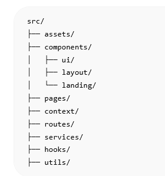

## INNOVALAB FRONT-END

Aplicación web educativa enfocada en el aprendizaje de matemática para adultos mediante ejercicios interactivos y elementos de gamificación.

El objetivo del proyecto es ofrecer una experiencia de aprendizaje accesible, dinámica y progresiva para personas que desean reforzar conocimientos matemáticos sin frustración ni presión académica tradicional.

--------------------------------------------------------------------------------------

# Tecnologías utilizadas

- React
- Vite
- React Router DOM
- Bootstrap
- React Bootstrap

--------------------------------------------------------------------------------------

# Gestor de paquetes

El proyecto utiliza **pnpm** como gestor de paquetes dentro de una arquitectura monorepo.

## Instalar pnpm globalmente

```bash
npm install -g pnpm
```

---------------------------------------------------------------------------------------

# Instalación y ejecución

## 1. Clonar el repositorio

```bash
git clone <url-del-repositorio>
```

---------------------------------------------------------------------------------------

## 2. Ingresar a la carpeta del Front-End

```bash
cd Front-End
```

---------------------------------------------------------------------------------------

## 3. Instalar dependencias

```bash
pnpm install
```

---------------------------------------------------------------------------------------

## 4. Ejecutar entorno de desarrollo

```bash
pnpm dev
```

La aplicación se ejecutará en:

```bash
http://localhost:5173
```

---------------------------------------------------------------------------------------

# Dependencias instaladas

## Crear proyecto con Vite

```bash
pnpm create vite@latest
```

## Bootstrap + React Bootstrap

```bash
pnpm add bootstrap react-bootstrap
```

## React Router DOM

```bash
pnpm add react-router-dom
```

-----------------------------------------------------------------------------------------

# Estructura inicial del proyecto



```text
Front-End/
├── public/
├── src/
│   ├── assets/          # Imágenes, iconos y recursos estáticos
|       ├──              # Carpeta con el nombre (con los archivos de .jsx y .css)
│   ├── components/      # Componentes reutilizables
│   ├── pages/           # Vistas principales
│   ├── routes/          # Configuración de rutas
│   ├── App.jsx
│   └── main.jsx
├── package.json
├── pnpm-lock.yaml
└── README.md
```

--------------------------------------------------------------------------------------------

# Objetivos iniciales del Front-End

- Construir una interfaz accesible y amigable
- Implementar navegación entre pantallas
- Crear sistema de módulos y micro-lecciones
- Diseñar experiencia gamificada
- Mantener una estructura escalable para trabajo en equipo

---------------------------------------------------------------------------------------------

# Estado actual del proyecto

🚧 Proyecto en etapa inicial de desarrollo.

Actualmente se encuentra en:
- planificación de arquitectura
- organización de componentes
- definición de flujo de usuario
- armado inicial de vistas y navegación

------------------------------------------------------------------------------------------------

# Futuras tecnologías a evaluar

Estas herramientas podrían incorporarse más adelante según las necesidades del proyecto:

- Axios
- Zustand
- React Hook Form
- Zod

-------------------------------------------------------------------------------------------------

# Arquitectura del proyecto

El proyecto forma parte de una arquitectura **Monorepo**, donde Front-End y Back-End conviven dentro de un mismo repositorio para facilitar:
- trabajo colaborativo
- organización del código
- manejo centralizado de dependencias
- scripts compartidos

Ejemplo:

```text
proyecto-matematicas/
├── Front-End/
├── Back-End/
└── package.json
```

-------------------------------------------------------------------------------------------------

# Scripts útiles

## Iniciar entorno de desarrollo

```bash
pnpm dev
```

## Generar build de producción

```bash
pnpm build
```

## Visualizar build localmente

```bash
pnpm preview
```

--------------------------------------------------------------------------------------------------

# Equipo Front-End

Proyecto desarrollado para InnovaLab 2026.
