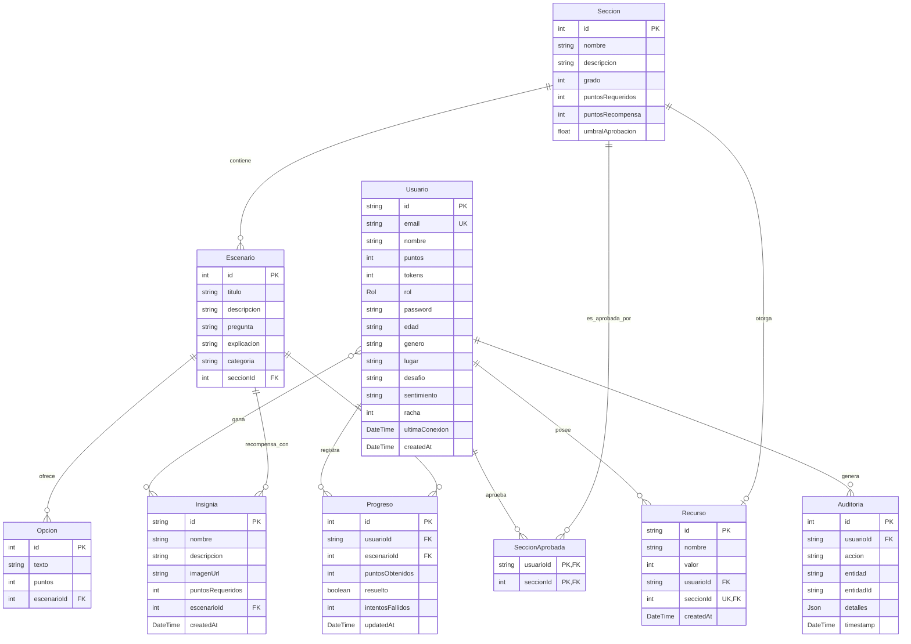
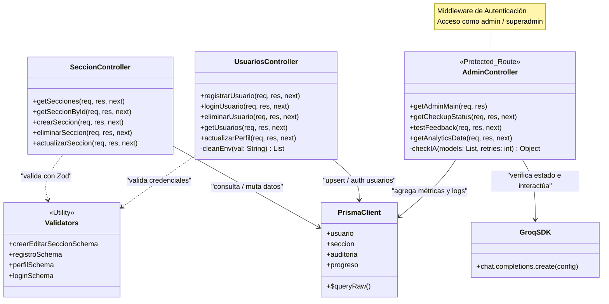

# Mate+

Una plataforma de entrenamiento para actividades matemáticas de la vida diaria


---

## Nuestro equipo

<p>


</p>

## Backend Core

Pre-Beta 1.0 para el Back End del proyecto "Aplicación de aprendizaje de Matemática" en **InnovaLab**. La arquitectura está diseñada para ser escalable, profesional y compatible con entornos de despliegue serverless en **Vercel** y **PostgreSQL** en **Supabase**.

### Arquitectura

El proyecto se gestiona bajo una estructura de **Monorepo** utilizando `pnpm workspaces`. Esta configuración permite mantener el código del Back-End y del Front-End en un único repositorio "serverless", facilitando la gestión de dependencias compartidas y scripts de automatización desde la raíz del proyecto.

### Modelo de datos

Los archivos ubicados en Back-End/data/*.csv representan el modelo lógico de datos del proyecto.
Durante el desarrollo pueden editarse directamente para agregar registros o modificar datos iniciales.
Puede utilizarse Prisma con estos archivos para que, durante el proceso de inicialización, se pueble automáticamente la base PostgreSQL (Supabase), evitando la edición manual desde el panel web.

#### Stack Tecnológico

- **Runtime:** **Node.js** v24+
- **Framework:** **Express.js** v5 (Beta/LTS compatible)
- **ORM:** **Prisma** v6.4.1 (Stable - Native Engines)
- **Gestor de Paquetes:** `pnpm`
- **Base de Datos:** **PostgreSQL** (vía **Supabase**)
- **Gestor de Registro e Inicio de Sesión:** **Supabase Auth**
- **Despliegue:** **Vercel**
- **Integración LLM-CLI:** **Groq (Llama 3.1 / Qwen)**
- **UX/UI:** Plantilla **FIGMA**

#### Roles y Permisos
- **usuario:** Perfil estándar para participantes. Acceso a escenarios interactivos y seguimiento de progreso.
- **admin:** Perfil con permisos de edición sobre contenidos (Secciones y Escenarios), edición de "prompt" de modelado del CLI pedagógico y acceso a Cuadros Estadísticos.
- **superadmin:** Perfil de gestión total, incluyendo edición de contenidos y manejo de credenciales/permisos.

#### Resiliencia en respuesta LLM-CLI (Fallback):
En caso de que no haya una Key configurada o se excedan los límites de cuota, el sistema activará automáticamente un modo de respaldo. En lugar de fallar, el servidor responderá utilizando la explicación técnica predefinida en el campo `explicacion` de la tabla **Escenarios**.

#### Auditoría
Se mantiene un seguimiento de las actividades de modificación en la tabla Auditoría.

### Nodo Administrativo

Consola de relevamiento y actividades administrativas, con acceso desde dirección web [/ConsolaAdmin](https://deploy-mate-mas-front-end.vercel.app/ConsolaAdmin) y requerimientos de inicio de sesión para su uso, brinda información relativa al estado y funcionamiento del Back-End, el LLM-CLI y la conexión de datos y también es el punto de acceso para los administradores desde el que pueden manejar condiciones y probar resultados del LLM-CLI, crear, editar buscar o eliminar en las tablas de Secciones y Escenarios y acceder a los gráficos de Analisis de Datos en tiempo real.

### Estructura del Proyecto

```bash
proyecto-matematicas-grupo8/
├── Back-End/
│   ├── api/
│   │   └── index.js
│   ├── prisma/
│   │   ├── schema.prisma
│   │   └── seed.js
│   ├── src/
│   │   ├── assets
│   │   │   ├── logonodo.png
│   │   │   ├── mascota_32.webp
│   │   │   └── mascota_510.webp
│   │   ├── config/
│   │   │   ├── prisma.js
│   │   │   └── supabase.js
│   │   ├── controllers/
│   │   │   ├── admin.controller.js
│   │   │   ├── auditoria.controller.js
│   │   │   ├── debug.controller.js
│   │   │   ├── escenario.controller.js
│   │   │   ├── progreso.controller.js
│   │   │   ├── seccion.controller.js
│   │   │   └── usuarios.controller.js
│   │   ├── exceptions/
│   │   │   └── api.exception.js
│   │   ├── middlewares/
│   │   │   ├── auth.middleware.js
│   │   │   ├── audit.middleware.js
│   │   │   └── error.middleware.js
│   │   ├── routes/
│   │   │   ├── api.routes.js
│   │   │   ├── progreso.routes.js
│   │   │   ├── seccion.routes.js
│   │   │   └── usuarios.routes.js
│   │   ├── services/
│   │   │   └── llm-cli.service.js
│   │   ├── validators/
│   │   │   ├── seccion.validator.js
│   │   │   └── usuarios.validator.js
│   │   └── app.js
│   ├── supabase/
│   │   ├── .gitignore
│   │   └── config.toml
│   ├── .gitignore
│   ├── nodemon.json
│   ├── package.json
│   ├── vercel.json
│   ├── Readme.md
│   └── test.sql
├── Front-End/
├── .gitignore
├── .npmrc
├── package.json
├── pnpm-lock.yaml
├── pnpm-workspace.yaml
└── Readme.md
```

### Diagrama de Entidad-Relación (ERD)



---


### Diagrama de Clases



---
### Historial

- Revisión de tecnologías y arquitectura propuesta.
- Planteo de Proyecto “Math-Path”.
- Planteo de uso de tecnologías ‘pnpm’ y Prisma.
- Planteo de despliegue Vercel “serverless”.
- Primer commit.
- Definición e implementación de Stack.
  · Configuración de modelo y entorno para la base de datos remota (Prisma).
- Esquema de entidades: Usuarios, Sección, Escenario.
  . Lógica en controladores de Secciones y Escenarios.
  · Lógica en controladores de Usuarios, Admin y Superadmin.
- Documentación en “Back-End Readme.md”.
- Actualización en repositorio
- Configuración de Bd de test en PostgreSQL.
  · Migración de esquema ‘Prisma’.
  · Sembrado de datos mock.
  · Configuración de ‘Auth’.
- Configuración e implementación de ‘servidor modular local’ funcional.
- Listado e implementación de endpoints base para testing y pruebas de impacto.
- Actualización de Documentación y repositorio.
- Implementación de Test de LogIn y Registro.
  · Test “local” de ruteo del CRUD de endpoints.
  · Branch de oficio, acceso para Q&A.
- Infraestructura para Prueba de Concepto.
  · Cuentas Google, Supabase y Vercel.
- Inicio de implementación de validaciones.
  · Implementación de biblioteca y esquemas de validación Zod.
Actualización de Back-End en "main"
- Implementación de doble origen de datos
 · con archivos locales y WebDb
- Mecanismo para respuestas de inicio de sesión,
 · registro de usuarios persistente en archivo local
- Nodo administrativo (beta)
 · Gestión de estado Back-End
 · Gestión de asistencia CLI-LLM (beta)
 · Gestión de CRUDs de contenidos (beta)
 · Gestión de grafos estadísticos
Reunión con integrantes de Front-End y Q&A
Actualización de rama “producción-test” eliminando las implementaciones de simulación para Registro, Inicio de sesión y Db, actualización de Documentación
Test de despliegue de Producción activa en Vercel con conexión a WebDb
Revisión y optimización de Back-End

---

*Propuesta desarrollada para el equipo de Back End - InnovaLab 2026*


## INNOVALAB FRONT-END

Aplicación web educativa enfocada en el aprendizaje de matemática para adultos mediante ejercicios interactivos y elementos de gamificación.

El objetivo del proyecto es ofrecer una experiencia de aprendizaje accesible, dinámica y progresiva para personas que desean reforzar conocimientos matemáticos sin frustración ni presión académica tradicional.

--------------------------------------------------------------------------------------

# Tecnologías utilizadas

- React
- Vite
- React Router DOM
- Bootstrap
- React Bootstrap

--------------------------------------------------------------------------------------

# Gestor de paquetes

El proyecto utiliza **pnpm** como gestor de paquetes dentro de una arquitectura monorepo.

## Instalar pnpm globalmente

```bash
npm install -g pnpm
```

---------------------------------------------------------------------------------------

# Instalación y ejecución

## 1. Clonar el repositorio

```bash
git clone <url-del-repositorio>
```

---------------------------------------------------------------------------------------

## 2. Ingresar a la carpeta del Front-End

```bash
cd Front-End
```

---------------------------------------------------------------------------------------

## 3. Instalar dependencias

```bash
pnpm install
```

---------------------------------------------------------------------------------------

## 4. Ejecutar entorno de desarrollo

```bash
pnpm dev
```

La aplicación se ejecutará en:

```bash
http://localhost:5173
```

---------------------------------------------------------------------------------------

# Dependencias instaladas

## Crear proyecto con Vite

```bash
pnpm create vite@latest
```

## Bootstrap + React Bootstrap

```bash
pnpm add bootstrap react-bootstrap
```

## React Router DOM

```bash
pnpm add react-router-dom
```

## React Iconos

```bash
pnpm install font-awesome
pnpm install @fortawesome/react-fontawesome @fortawesome/free-solid-svg-icons @fortawesome/fontawesome-svg-core
pnpm install @fortawesome/free-regular-svg-icons @fortawesome/free-brands-svg-icons
```


-----------------------------------------------------------------------------------------

# Estructura inicial del proyecto


```text
Front-End/
├── public/
├── src/
│   ├── assets/          # Imágenes, iconos y recursos estáticos
|       ├──              # Carpeta con el nombre (con los archivos de .jsx y .css)
│   ├── components/      # Componentes reutilizables
│   ├── pages/           # Vistas principales
│   ├── routes/          # Configuración de rutas
│   ├── App.jsx
│   └── main.jsx
├── package.json
├── pnpm-lock.yaml
└── README.md
```

--------------------------------------------------------------------------------------------

# Objetivos iniciales del Front-End

- Construir una interfaz accesible y amigable
- Implementar navegación entre pantallas
- Crear sistema de módulos y micro-lecciones
- Diseñar experiencia gamificada
- Mantener una estructura escalable para trabajo en equipo

---------------------------------------------------------------------------------------------

# Estado actual del proyecto

🚧 Proyecto en etapa inicial de desarrollo.

Actualmente se encuentra en:
- planificación de arquitectura
- organización de componentes
- definición de flujo de usuario
- armado inicial de vistas y navegación

------------------------------------------------------------------------------------------------

# Futuras tecnologías a evaluar

Estas herramientas podrían incorporarse más adelante según las necesidades del proyecto:

- Axios
- Zustand
- React Hook Form
- Zod

-------------------------------------------------------------------------------------------------

# Arquitectura del proyecto

El proyecto forma parte de una arquitectura **Monorepo**, donde Front-End y Back-End conviven dentro de un mismo repositorio para facilitar:
- trabajo colaborativo
- organización del código
- manejo centralizado de dependencias
- scripts compartidos

Ejemplo:

```text
proyecto-matematicas/
├── Front-End/
├── Back-End/
└── package.json
```

-------------------------------------------------------------------------------------------------

# Scripts útiles

## Iniciar entorno de desarrollo

```bash
pnpm dev
```

## Generar build de producción

```bash
pnpm build
```

## Visualizar build localmente

```bash
pnpm preview
```

--------------------------------------------------------------------------------------------------

# Equipo Front-End

*Proyecto desarrollado para InnovaLab 2026.*
